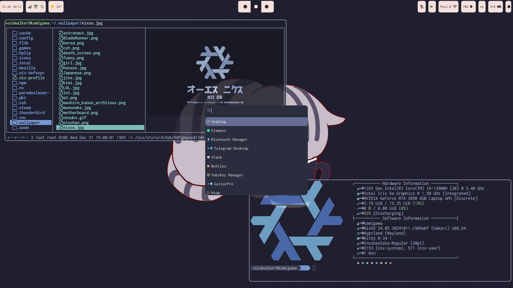
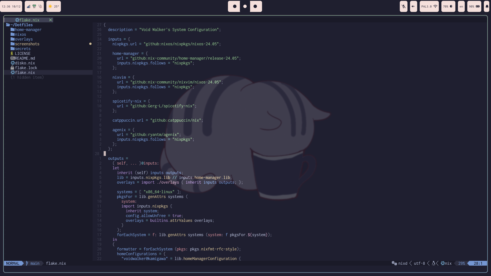
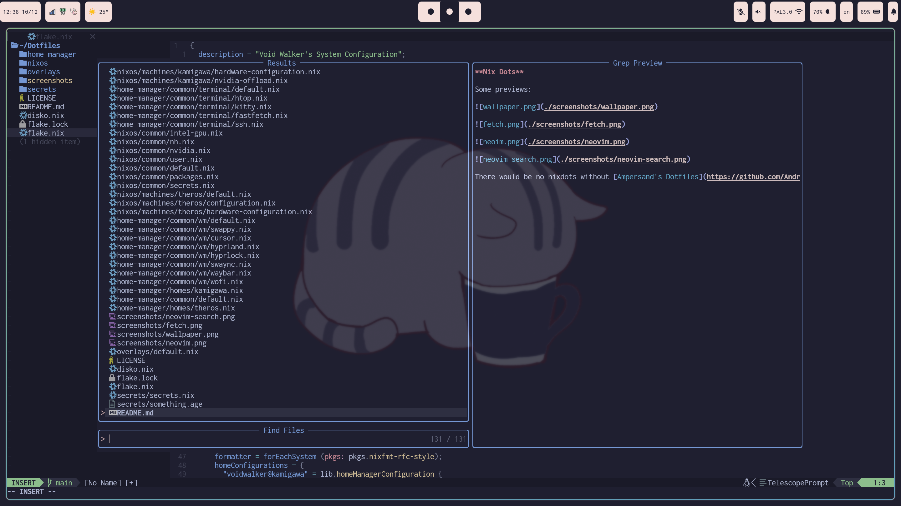

**Nix Dots**

Some previews:

There would be no nixdots without [Ampersand's Dotfiles](https://github.com/Andrey0189/nixos-config) it really helped me as the starting point. Also [My Friend's Dotfiles](https://git.sr.ht/~fd/nix-configs) helped me to setup config for multiple systems.
